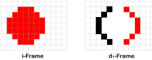

# 1
Herunterskalieren

# 2
Nein

# 3
4:4:4 -> 0%
4:2:2 -> 33.33%
4:1:1 -> 50%
4:2:0 -> 50%

# 4
Weil die Bildschäfe im Y wert ist und dieser Bei 4 bleibt.

# 5
Weil zu viele Pixel zusammengefasst werden und dann die farbe etwas "falsch" herüberkommt.

# 6
GOP steht für Group of Pictures heisst man bekommt für jedes 25stes Bild in einem Video ein Volles "I" Bild.

# 7
A weil es dann fast nur ein einziges Image benötigt und für den Rest kann man Komprimieren.

# 8

